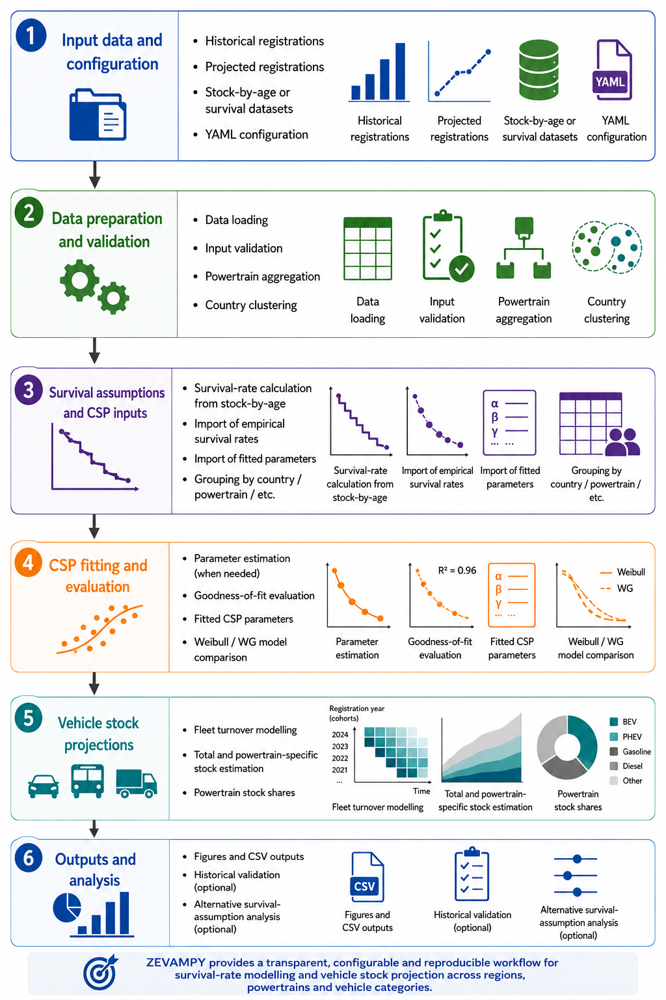

# Summary

Vehicle stock turnover models are widely used to analyze the long-term evolution of vehicle fleets under different technological, economic, and policy assumptions [@jochem2018methods]. These models support applications such as estimating future energy and infrastructure demand, evaluating decarbonization pathways, and assessing zero-emission vehicle adoption [@Ellingsen.2016; @GomezVilchez.2020]. ZEVAMPY (Zero-Emission Vehicle Adoption Model in Python) is an open-source Python framework for modelling vehicle stock evolution using configurable vehicle-registration scenarios and vehicle survival assumptions. Users can derive empirical survival rates from stock-by-age data, provide empirical survival rates directly, or supply previously fitted cumulative survival probability (CSP) parameters. Survival assumptions can be defined at country level or separately for country–powertrain combinations. ZEVAMPY combines historical and projected vehicle registrations with CSP curves in a cohort-based stock-turnover calculation to estimate future vehicle stock by powertrain and vehicle age. The framework additionally includes input validation and an optional historical-validation workflow. The software is designed to be reusable across geographic regions, vehicle categories, powertrain classifications, and projection horizons when suitable registration and survival data are available.

# Statement of need

Numerous vehicle adoption and fleet-transition models have been developed with different geographic scopes, modelling assumptions, explanatory variables, and data sources [@Kumar.2020;@Maybury.2022]. These models are widely used to analyse transportation decarbonization pathways, future energy demand, and the diffusion of alternative vehicle technologies. However, many modelling approaches remain difficult to reproduce, are not openly available, or are tightly coupled to specific datasets and case-study assumptions, limiting transparency, adaptability, and reuse across transportation-modelling applications [@jochem2018methods].

Vehicle stock turnover dynamics are also frequently represented using simplified or fixed survival assumptions, despite their strong influence on projected fleet composition and electrification rates [@Held.2021]. Estimating empirical CSP curves from stock and registration data requires consistent cohort alignment, survival-rate estimation, curve fitting, and stock calculation. Repeating these steps for different territories or powertrain groups can therefore require substantial data processing and methodological harmonization.

ZEVAMPY addresses these limitations by separating modelling logic, configuration settings, and input datasets within a reusable Python framework. The software was initially developed around a specific research application, but the current implementation has been refactored to remove case-specific assumptions from the core workflow. Users can configure territories, powertrains, projection horizons, survival-data sources, and survival-rate grouping without modifying the model implementation.

The framework provides reusable workflows for empirical survival-rate estimation, CSP fitting, vehicle stock projection, input validation, and historical validation. Alternative registration or survival assumptions can be evaluated by rerunning the same modelling workflow with different input datasets or CSP parameters. This structure supports transparent and reproducible fleet-turnover analysis while allowing the same software to be applied to new research questions when compatible data are available.

ZEVAMPY is fully developed in Python and is openly available on GitHub at <https://github.com/gabrielmoringmartinez/zevampy>.

# Modelling approach

ZEVAMPY implements a configurable cohort-based workflow for vehicle stock turnover and fleet-composition modelling. The main workflow is illustrated in \autoref{figure1}.

Users provide historical and projected total vehicle registrations, powertrain registration shares, a YAML configuration file, and one of three supported forms of survival rates information. With the `stock_by_age` source, ZEVAMPY derives empirical survival rates from age-resolved vehicle stock and corresponding registration cohorts before fitting CSP curves. With the `empirical` source, already-derived empirical survival rates are supplied directly and ZEVAMPY performs the CSP fitting. With the `parameters` source, previously fitted or externally supplied CSP parameters are used directly without repeating the empirical-rate derivation or parameter-fitting steps.

Survival assumptions can be grouped by country or by country and powertrain. In the latter case, separate survival assumptions are provided for the complete `Total` fleet and for each explicitly modelled powertrain. This allows, for example, different turnover behaviour to be represented for battery-electric and combustion-engine vehicles while maintaining an independent estimate of the complete fleet stock.

When curve fitting is required, ZEVAMPY estimates parameterized CSP functions from the empirical survival observations and evaluates goodness of fit. The fitted CSP curves are then combined with vehicle-registration cohorts to estimate surviving stock by vehicle age and simulation year. Selected powertrains are calculated from their registration shares, while `Total` stock is calculated independently from total registrations. Technology stock shares are therefore calculated relative to the complete fleet rather than from the sum of only the explicitly modelled technologies.

The framework produces CSV and graphical outputs including registrations by powertrain, empirical survival rates, fitted CSP parameters and curves, vehicle stock by age and powertrain, and stock shares. An optional historical-validation workflow compares modelled stock shares with observed historical registration and stock-share data for a configurable validation powertrain.

By separating data, configuration, survival assumptions, and stock-calculation logic, ZEVAMPY supports reproducible fleet-turnover modelling across different territories, powertrain classifications, and scenario assumptions without requiring changes to the core source code.

# Projects and publications

Earlier versions of the modelling workflow were developed and applied in transportation research before the software was generalized into the current reusable ZEVAMPY framework.

An early application estimated future battery-electric vehicle (BEV) stock shares across EU-27 countries and Norway using country-specific empirical survival rates and projected vehicle-registration scenarios [@MoringMartinez.2025b]. This study analysed how fleet-turnover dynamics influence long-term electrification pathways under alternative survival assumptions.

The modelling workflow was also adapted for a Germany-focused case study investigating future BEV fleet evolution under different battery chemistries and bidirectional-charging assumptions [@Hasselwander.2025]. In that application, the stock model was coupled with technology-specific vehicle-registration scenarios to analyse future fleet composition and charging-related implications.

These research applications motivated the initial development of ZEVAMPY. The current software extends beyond those case studies by supporting configurable survival-data sources, country–powertrain-specific survival assumptions, user-defined territories and powertrain selections, and an independently modelled complete fleet denominator. The resulting framework can therefore be reused for additional fleet-turnover applications when the required input data are available.

# Acknowledgements

Development of ZEVAMPY was supported through the NDC ASPECTS project, which received funding from the European Union’s Horizon 2020 Research and Innovation Programme under grant agreement No. 101003866. Additional support was provided through the MoDa project of the German Aerospace Center (DLR).

# AI usage disclosure

OpenAI ChatGPT was used during the development and revision of ZEVAMPY as an assistive tool for selected software-engineering and writing tasks. For the software, ChatGPT was used to support code review, refactoring, debugging, test development, documentation, and the implementation of specific changes identified during the JOSS review process. The purpose of the software, its scientific methodology, modelling assumptions, original architecture, and initial implementation were developed by the author independently. All AI-assisted code changes were reviewed by the author, integrated selectively, and subsequently tested and validated against the expected model behaviour.

The paper was written by the author. ChatGPT was used to improve wording, clarity, and structure of text drafted by the author, rather than to generate the scientific content or conclusions. All AI-assisted text was reviewed and edited by the author.

The author retains full responsibility for the design, implementation, scientific content, validation, and conclusions presented in the software and paper.

# References

